# Threat Hunting Essential - Attack Recognition Techniques Part 2  

---

## 目錄

- 第一章、 環境設置	2  
  - 第一節、 整體架構	2  
  - 第二節、 opnsense 中wazuh agent 以及 IDS (suricata) 設定	6  
- 第二章、 成果展示	12  
  - 第一節、 使用 wazuh mcp	12  
  - 第二節、 將pfsense的資料有效傳送到 wazuh 上進行偵測與回應	15  
  - 第三節、 ET-BERT 使用體驗	17  
- 第三章、 總結及參考資料	18  
  - 第一節、 總結	18  
  - 第二節、 參考資料	19  

---

## 第一章、環境設置

### 第一節、整體架構

圖一中為作業第一題和第二題會用到的設備，有

- 伺服器(pve)
  - wazuh server
  - opnsense
  - suricata rule server
  - VPN server (使用 wireguard)

- 在本地端機器上(我的筆電)
  - windows 10 vm
  - kali vm

- AI server(我家裡的 windows 11 桌機)

我為了分散每台機器(包括pve伺服器、到處跑的筆電以及家裡的桌機)的運行壓力，所以才會這樣設計。

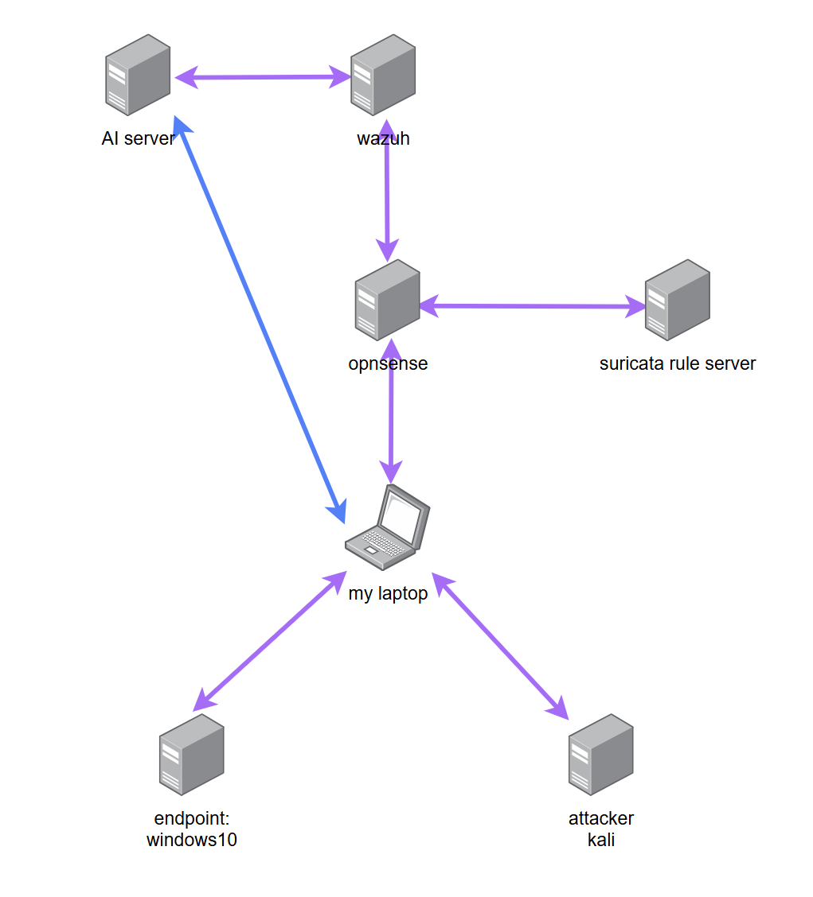
 **圖一、作業第一題和第二題整體架構**

如圖二所示，我把windows虛擬機(我們假定要被攻擊的目標，下簡稱端點windows)以及kali(我們假定要做攻擊的機器，下簡稱kali)設定在同一個網路環境下，kali 可以直接訪問到端點windows。

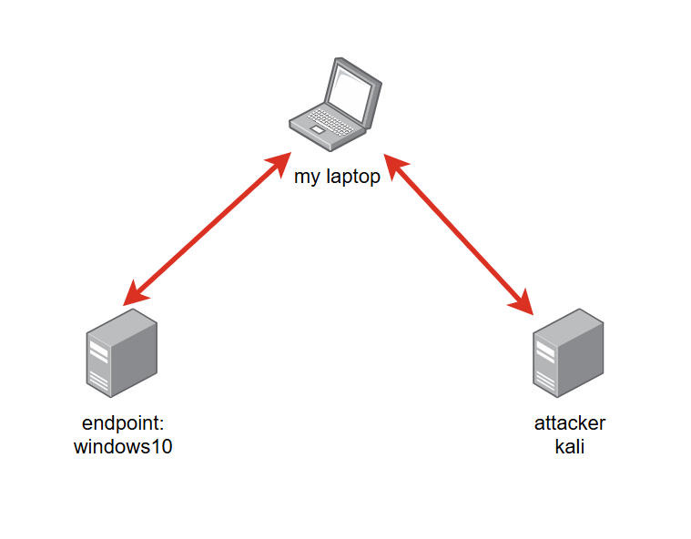
 **圖二、端點 windows 虛擬機和攻擊者 kali 的架構**

同時如圖三所示，端點windows 可將日誌(log)傳到wazuh server 上，並且所有流量都會通過 opnsense(這個架在pve上的設備有將很多功能集成在上面，有防火牆、路由、IDS等功能，同時這也是pfsense的另一個distro，我以下簡稱opnsense) 這個設備，最後才會將所有日誌(包括windows上的以及opnsense的)

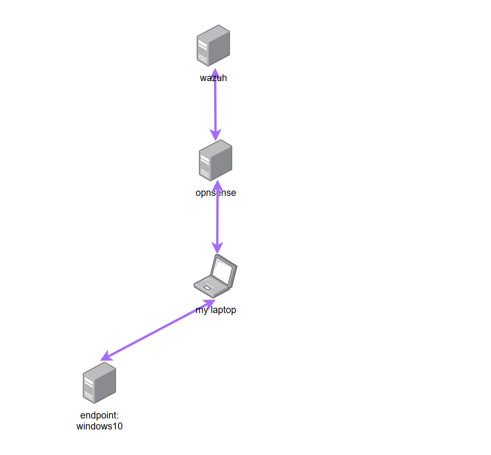
 **圖三、端點 windows 10 和wazuh 的架構**

### 第二節、opnsense 中wazuh agent 以及 IDS (suricata) 設定

由於opnsense社群有設計專門給其設計對應的wazuh agent(再次感嘆開源社群的強大)之插件(plugin)所以我們直接到opnsense System>Firmware>Plugins中就可以找到os-wazuh-agent的插件。  
然後接著就是在Services>Wazuh Agent>Settings中調設定，除了在Applications中的Firewall和Suricata(IDS)在我們這次實作中會用到之外，其餘設定跟把wazuh agent佈署在其他端點中差不多。詳細可看圖四  
opnsense 內建 Intrusion Detection 的功能，並且其使用 suricata。如圖五所示，我設定只有兩個網路介面，分別是模擬內網的VPN以及會連到網際網路的WAN，特徵偵測(Pattern Matcher)我將其設定為Hyperscan。  
註: 在開啟IDS前我有先到suricata的Interfacess>Settings中設定Hardware CRC、Hardware TSO、Hardware LRO以及VLAN Hardware Filtering關閉  
不過由於沒辦法直接在opnsense上面直接設定IDS的規則，所以用到自架的suricata rule server，我在上面寫opnsense使用rule server的設定(custom.xml)以及IDS的規則(custom.rules)，詳見圖六、圖七。其中我用scp指令將custom.xml放入opnsense裡面，然後opnsense的IDS就會知道要去suricata rule server上更新我們自定義的IDS規則，對此我是用python打開http server去實現讓opnsense更新IDS規則。詳見圖八  
這樣，把opnsense中Intrusion Detection的服務重啟後，並更新規則後，就可以成功使用我們自訂的內容。具體如圖九、圖十。  
見圖十一，到Services>Intrusion Detection>Administration>Rules(或是Policy中的Rule adjustments)，我們打開任意的規則細節後，可以自由選擇當偵測到該細節時是要選擇警告然後放行，還是直接將該流量擋掉。

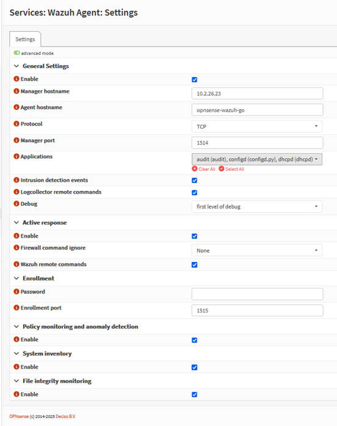
 **圖四、opnsense wazuh agent 設定參考**

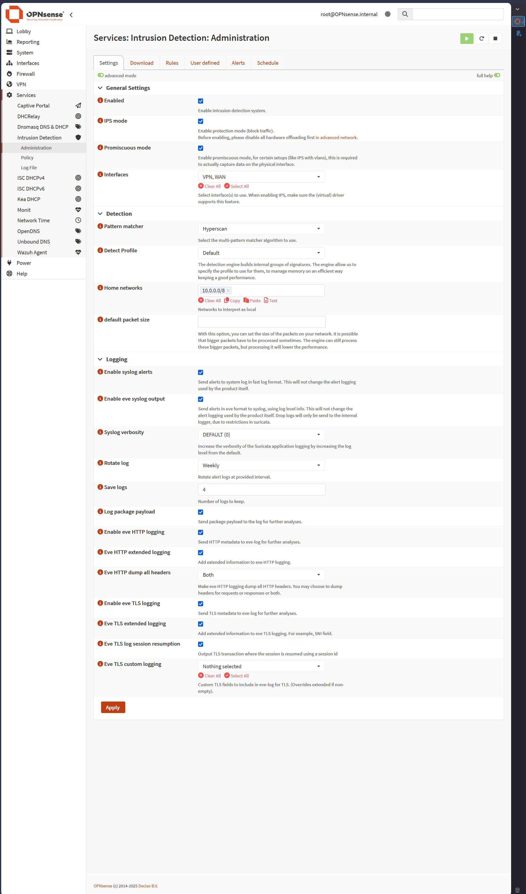
 **圖五、opnsense IDS 的一般設定參考**

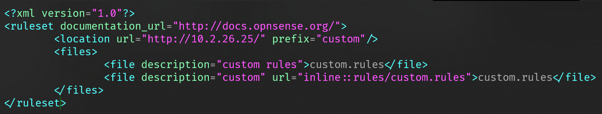
 **圖六、custom.xml 設定**

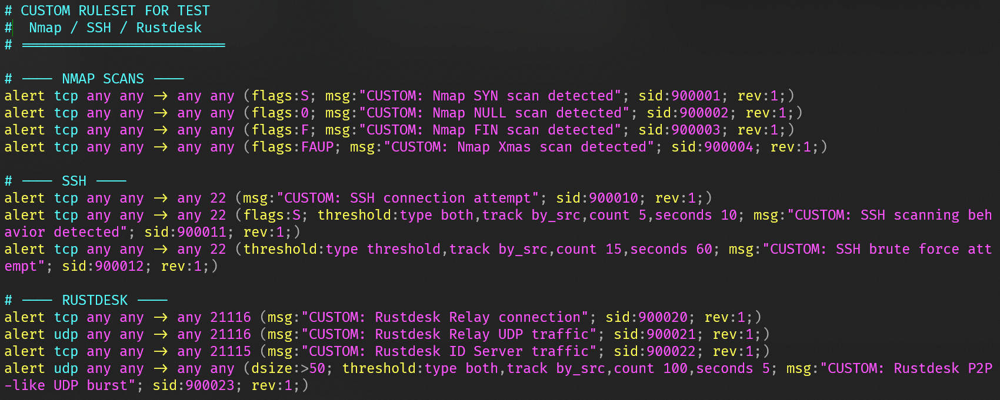
 **圖七、custom.rules 設定**

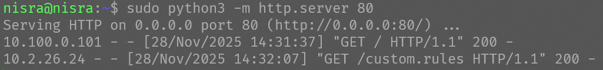
 **圖八、http server 使用 python，圖中可以看到有兩個IP嘗試存取此設備，一個是我的電腦，另外一個則是 opnsense**

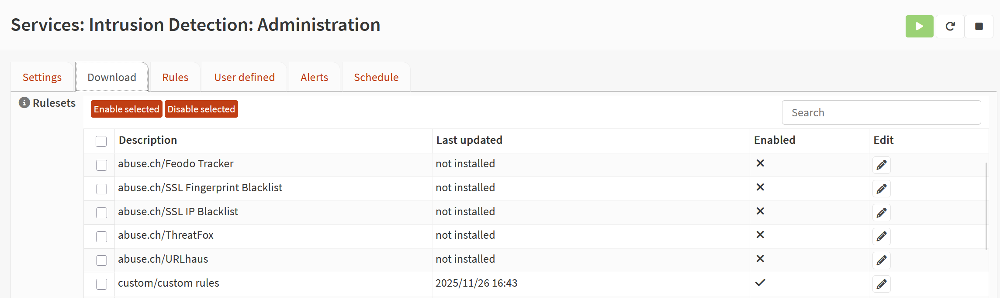
 **圖九、可以看到opnsense有讀取到custom.xml的內容了，並且成功寫入進去**

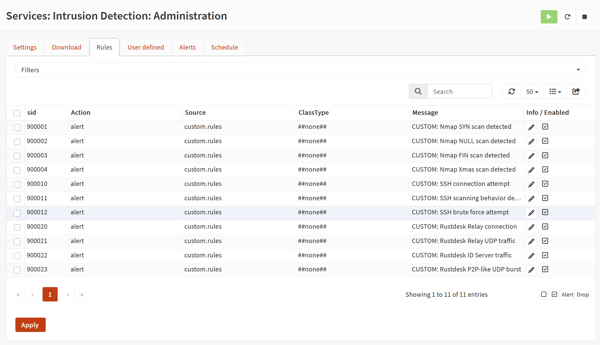
 **圖十、可以看到匯入到opnsense的IDS規則已經可供我們使用**

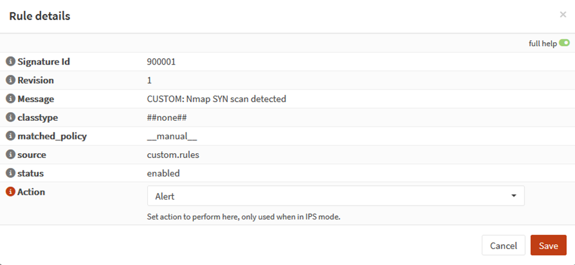
 **圖十一、我們打開任意的規則細節後，可以自由選擇當偵測到該細節時是要選擇警告然後放行，還是直接將該流量擋掉**

於是這樣我們就正式設定完成opnsense上防火牆和IDS與wazuh的交互

## 第二章、成果展示

### 第一節、使用 wazuh mcp

如若MCP server 和AI server 放在一起，這會遇到，wazuh indexer 只聽 localhost:9200 port。所以需要先在 wazuh server 中修改 wazuh indexer 的設定檔案，讓server不會只聽 localhost。詳見圖十二。  
接著在AI server上設定mcp server，由於我希望使用本地的大語言模型 (LLM) 去跑(當然在 cloude desktop 上我也有跑過)，所以我還要修改軟體(LM studio)裡的MCP.json 即可。

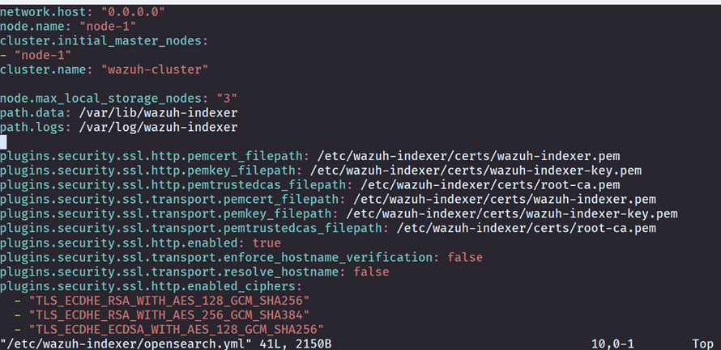
 **圖十二、/etc/wazuh-indexer/opensearch.yml 的設定**

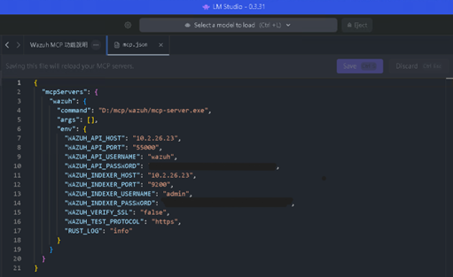
 **圖十三、、mcp.json 的設定**

在系統設計過程中，我為 SOC Copilot 設計了一組 system prompt，作為大語言模型在 Wazuh SIEM 與 MCP 工具架構下的行為規格。此 prompt 明確定義模型的角色定位與責任邊界，將其限制為分析輔助者，而非決策或回應執行者，所有輸出僅能基於 MCP 工具回傳的可驗證資料。  
在初期設計中，嘗試透過較完整的規則描述與範例（few-shot）引導模型在不同使用情境下切換回應模式，例如於威脅獵捕情境中進入 Investigation Mode 並套用結構化回應規則，而在系統狀態查詢或端點健康度統計時，僅回傳事實性資訊。同時，prompt 亦支援依使用者輸入自動切換中英文輸出。  
然而實際測試後發現，過於細緻的規則與模式切換設計容易使小型語言模型產生過度推理行為，不僅增加回應延遲，也提高在模糊情境下自行補齊敘事、進而產生幻覺（hallucination）的風險。  
因此，prompt 設計策略調整為採用「Hard Gating + Explicit Non-Inference Defaults」的方式。其中，Hard Gating 用以限制僅在使用者輸入包含特定調查關鍵字時，模型才允許進行威脅分析；其餘情境一律視為查詢或描述性任務。Explicit Non-Inference Defaults 則將「不推理、不下結論、僅陳述事實」設定為模型的預設行為，而非例外狀態。  
透過此設計，模型的行為被有效收斂至單一且可預期的回應路徑，在保留必要分析能力的同時，大幅降低過度推理與上下文污染的風險，並明顯提升回應效率與整體穩定性。完整的 prompt 設計內容詳見 system_prompt.txt。  
然後我使用千問三 80億參數的模型(qwen3-8b)，我有用過其他大語言模型測試過，如ibm的granite 4 H tiny-7b、meta llama 3.1 8B instruct、Deepseek R1 0528 Qwen3 8B，granite 4 H tiny-7B和llama 3.1 8B instruct沒有雖然都有被訓練可以使用一些工具，但是有時會陷入一直叫tool的死循環，而R1沒有設計可以用來使用工具，使用者輸入之後會陷入幻覺輸出一些大語言模型自以為可以用的建議給使用者，所以我最終使用qwen3-8b。並且LLM的溫度(temperature)我設定在0.4。  
然後在conversation.json是我在lmstudio中對LLM做對話的歷史紀錄，其中我問了六個問題，分別是

1. Analyze recent high-severity Wazuh alerts to assess the current security posture.
2. Investigate agent 003 by correlating its recent alerts, running processes, and open ports.
3. Correlate firewall-related alerts with endpoint authentication failures within a 10-minute window.
4. Based on the available evidence, summarize the incident and suggest the next MCP tool to use.
5. 列出目前所有 Wazuh agent 的狀態。
6. 列出 agent 001 中 vulnerability severity 為 High 的前五個漏洞。

最後得到的結果我非常滿意，不過要注意的是，我雖然在提示詞上下很多功夫，但是qwen-8b還是會看過去歷史談話內容，所以我測試後發現重開一個新的對話會有助於切換不一樣的情境時遇到LLM幻覺。詳見1.json、2.json、3.json

### 第二節、將pfsense的資料有效傳送到 wazuh 上進行偵測與回應

經過環境設定後，我們可以用kali使用nmap(見圖十四)即可在opnsense和wazuh收到警告，並且我們可以在opnsense上面設定是否要阻擋IDS偵測到的該流量(作法詳見圖十一)。並且我們能分別在opnsense和wazuh上面收到警告，詳見下圖十五和圖十六。

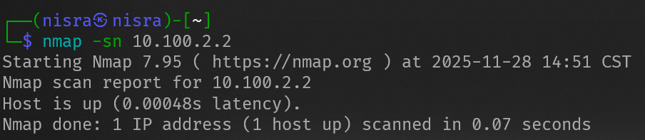
 **圖十四、kali對端點windows做情蒐(activate information gathering)**

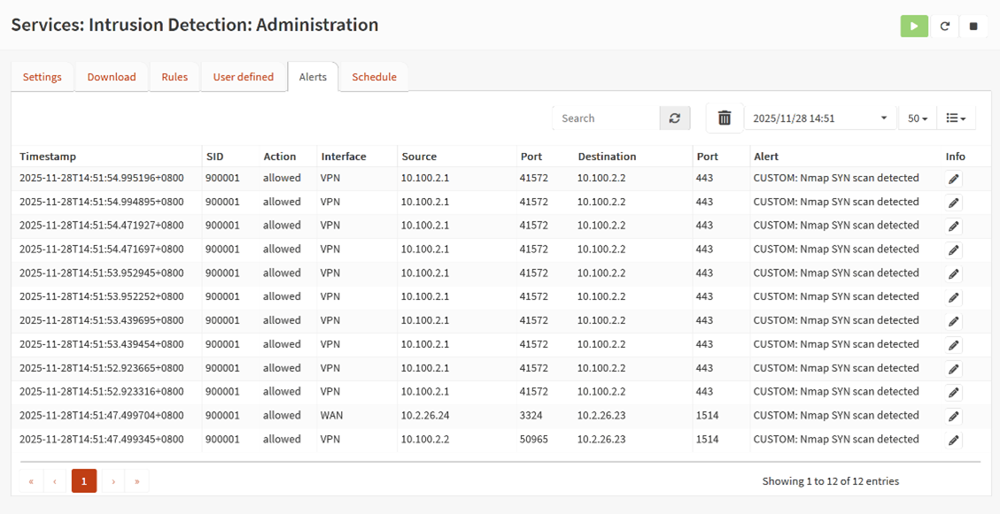
 **圖十五、opnsense 收到警告**

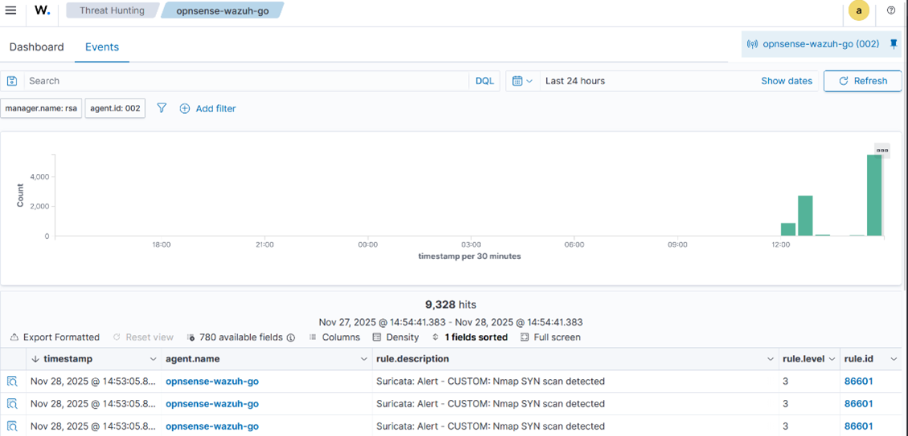
 **圖十六、wazuh收到警告**

### 第三節、ET-BERT 使用體驗

使用ET-BERT前，我們先需要把ET-BERT整個repo從github下載後先整理一下，包含，把dataset要fine-tuning的資料(cstnet-tls1.3的公開封包數據集)去下載，下載相關依賴的函示庫(對應的torch)，把run_classifier.py複製一份到run_classifier_infer.py等。  
接下來，根據其github的說明，需要先對pre-trained_model.bin進行fine-tuning(不然最後出來的結果很差，我已經試過了www)，我使用圖十七的指令去實作，然後再把做完fine-tuing的模型(finetuned_model.bin)用圖十八的指令去做推理(inference)，最後在資料集下有prediction.tsv顯示成果。  
我稍微比對test_dataset.tsv和模型預測的結果(prediction.tsv)高度吻合，表示我們成功的對ET-BERT做fine-tuning並且讓模型能夠有效補捉加密流量的行為特徵，而非隨機分類。

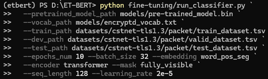
 **圖十七、對pre-trained_model.bin進行fine-tuning的指令**

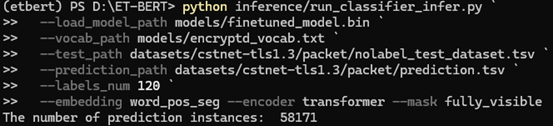
 **圖十八、對finetuned.bin進行inference測試用到的指令**

## 第三章、總結及參考資料

### 第一節、總結

從這次我們作業中，我首先將所有的服務分散不同的設備上，降低單一設備的運行壓力。接著我承接期中報告，詳細設定承擔路由、防火牆、入侵防護於一身的opnsense並且將其報告與wazuh可以做連動，並且入侵防護方面，做到了自定義規則、上傳規則最後自由決定規則執行的實作。  
第一個實作，我在提示詞上下很多功夫，同時也測試很多不一樣的大語言模型，發現有思維鍊的大語言模型會對於第一個時做有更大的幫助。我所設計的實作整體下來使用非常低成本的設備，達到符合預期的樣子，當然如果使用n8n AI agent workflow我覺得也會是一個非常有趣的方向。  
在第二個實作中，我實際對目標端點windows做activate information gathering並且演示opnsense能夠將辨識到的流量進行警告(alert)或是擋住(drop)回應的可能性。這個實作我使用了opnsense比pfsense更加多的GUI設計，對於一般的使用者來說，會更加容易使用。  
在第三個實作中，我使用ET-BERT的預訓練模型為基礎，使用CSTNET-TLS 1.3 資料集做微調(fine-tuning)，這麼做可以更貼近特定加密流量場景的行為分析，提升分類結果之語意一致性。並且將微調後的模型拿去使用未標註資料進行推論分析，得到非常好的結果，經過微調後的模型可以穩定的捕捉加密流量中特定行為模式。

### 第二節、參考資料

- 期中報告Threat Hunting Essential - Attack Recognition Techniques, 劉昱甫, 2025.10
- [Tutorial] Adding custom rules to Intrusion Detection, dcol, 2018.02.08, https://forum.opnsense.org/index.php?topic=7209.0
- ET-BERT: A Contextualized Datagram Representation with Pre-training Transformers for Encrypted Traffic Classification, Xinjie Lin, Gang Xiong, Gaopeng Gou, Zhen Li, Junzheng Shi, Jing Yu, 2022.02.13 ,https://doi.org/10.48550/arXiv.2202.06335
